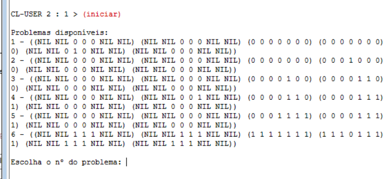
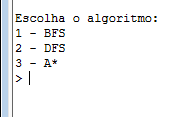

# **Manual de Utilizador**

### UC: Inteligência Artificial

### Ano Letivo: 2025/26

### Prof: Joaquim Filipe

### Autores:
Danilo Victor 202300224  
Jean Oliveira 202300095  
Lucas Almeida 202100067  

## Índice

- [1. Acrónimos e Convenções](#1-acrónimos-e-convenções)
- [2. Introdução](#2-introdução)
- [3. Instalação e Utilização](#3-instalação-e-utilização)
- [4. Input e Output](#4-input-e-output)
- [5. Exemplo de Aplicação](#5-exemplo-de-aplicação)

## **1. Acrónimos e Convenções**

### Acrónimos

- UC – Unidade Curricular
- I/O – Input/Output
- BFS - Breath-First Search (Procura em largura)
- DFS - Depth-First Search (Procura em altura)

### Convenções

- Arquivos em *itálico*
- Código em blocos

## **2. Introdução**

Este manual destina-se a utilizadores que pretendem executar e interagir com o programa de resolução do jogo *Solitário*, utilizando algoritmos de procura, desenvolvido no âmbito da UC de Inteligência Artificial lecionada pelo professor Joaquim Filipe.

### Finalidade do Software

O programa permite resolver automaticamente tabuleiros do jogo Solitário usando BFS, DFS e A*. Após a resolução, o resultado é gravado num ficheiro *resultados.dat*, junto com dados estatísticos sobre a eficiência do algoritmo escolhido face ao tabuleiro.

### Problema que Resolve

Dada as grandes possibilidades de movimentos que se pode realizar, este projeto tem a finalidade de resolver, num curto espaço de tempo, milhares de movimentos de forma a buscar a combinação com menor custo.  
Isto é, qual o mínimo de jogadas que é preciso realizar para que o jogo termine com sucesso.  

Também, este projeto tem como objetivo:

- Automatizar a resolução de tabuleiros.
- Permitir testar algoritmos de procura.
- Permitir visualizar estados e movimentos.

### Requisitos Satisfeitos

- Ler tabuleiros a partir de ficheiros.
- Validar movimentos.
- Executar os algoritmos BFS, DFS e A*.
- Mostrar a solução.
- Fornecer dados estastícos após a resolução de um tabuleiro.
- Exportar resultados para um ficheiro caso solicitado pelo utilizador.

----------------------------------------------------

## **3. Instalação e Utilização**

### 3.1 Requisitos do Sistema

- Sistema Operativo: Linux / Windows / macOS  
- Interpretador Lisp: LispWorks Personal Edition

### 3.2 Instalação

Como obter e carregar o programa:

- Transferir o código (ZIP ou GitHub).
- Abrir no interpretador Lisp.
- Trocar as diretorias da parte de leitura e escritura em arquivos para o sistema local.
- Compilar o ficheiro "*projeto.lisp*".

### 3.3 Arranque do Programa

Procedimento para iniciar:

- Comando principal no Listener:

    ```lisp
    (iniciar)
    ```

### 3.4 Comandos Disponíveis

Após o arranque do programa, será mostrado através duma interface uma série de opções em forma de lista, em que o utilizador deverá escolher uma das opções.



Imagem 1 - Interface para escolher o problema



Imagem 2 - Interface para escolher o algoritmo

----------------------------------------------------

## **4. Input e Output**

### 4.1 Tipo de Input Aceite

#### Input Interativo

Descrever opções que o utilizador escreve.

- números (1/2/3/...)
- letras (s/n)

#### Input por Ficheiro

Formato típico de tabuleiro:
(NIL NIL 1 1 1 NIL NIL)  
(NIL NIL 1 1 1 NIL NIL)  
(1 1 1 1 1 1 1)  
(1 1 1 0 1 1 1)  
(1 1 1 1 1 1 1)  
(NIL NIL 1 1 1 NIL NIL)  
(NIL NIL 1 1 1 NIL NIL)  

Significado:

- 1 = peça  
- 0 = vazio  
- NIL = espaço inexistente

### 4.2 Output Produzido

O programa pode produzir:

- Caminho da solução.
- Estatísticas sobre procura realizada.

#(Imagem do output arrumado)

----------------------------------------------------

## **5. Exemplo de Aplicação**

### 5.1 Caso de Sucesso

1. Carregar:

- Abrir *projeto.lisp* no LispWorks
- Alterar a diretoria na área de leitura e escritura de arquivos
- Compilar arquivo

2. Resolver:

    ```lisp
    (iniciar)
    ```

    - Escolher Problema a ser solucionado
    - Escolher algoritmo a ser usado
    - Escolher heuristica caso tenha escolhido os algoritmos "A*" ou "IDA*"
    - Escolher se deseja que resultado seja gravado

3. Ver resultado:

    abrir arquivo *resultados.dat*

### 5.2 Casos de Erro ou Insucesso

Exemplos:

- Formato inválido.
- Movimento impossível.
- Nenhuma solução.
- Tempo limite (se existir).
